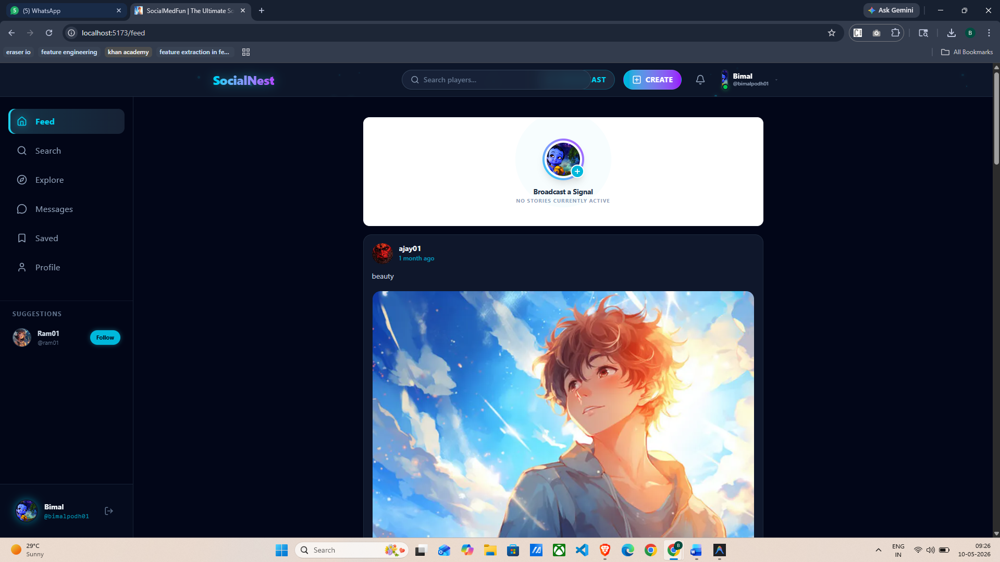

# 🚀 SocialMedFun

**SocialMedFun** is a modern, high-performance social media platform designed for gamers and creators. It features a premium "gaming" aesthetic with neon accents, glassmorphism, and smooth animations, providing an immersive user experience.



## ✨ Features

- 🎮 **Premium Gaming UI:** Dark-mode first design with neon highlights and glassmorphism.
- 🔐 **Secure Authentication:** Robust auth system powered by Firebase.
- 👤 **Dynamic Profiles:** Customizable user profiles with real-time updates.
- 📸 **Cloud Media:** Optimized image and video uploads via Cloudinary.
- 🔍 **Global Search:** Fast and responsive search for users and content.
- 📱 **Fully Responsive:** Seamless experience across desktop, tablet, and mobile.
- 🚀 **Production Ready:** Optimized for Vercel deployment with SEO best practices.

## 🛠️ Tech Stack

- **Frontend:** React.js, Vite
- **Styling:** Tailwind CSS v4, Framer Motion
- **Backend/Database:** Firebase (Auth, Firestore, Storage)
- **State Management:** Redux Toolkit
- **Media Management:** Cloudinary
- **Icons:** Lucide React

## 🚀 Installation & Setup

### 1. Clone the repository
```bash
git clone https://github.com/Bimalpodh/Social_medfun
cd SocialMedFun
```

### 2. Install dependencies
```bash
npm install
```

### 3. Environment Variables
Create a `.env` file in the root directory and add your credentials:

```env
VITE_FIREBASE_API_KEY=MY_api_key
VITE_FIREBASE_AUTH_DOMAIN=MY_auth_domain
VITE_FIREBASE_PROJECT_ID=MY_project_id
VITE_FIREBASE_STORAGE_BUCKET=MY_storage_bucket
VITE_FIREBASE_MESSAGING_SENDER_ID=MY_sender_id
VITE_FIREBASE_APP_ID=MY_app_id
VITE_FIREBASE_MEASUREMENT_ID=MY_measurement_id

VITE_CLOUDINARY_CLOUD_NAME=MY_cloud_name
VITE_CLOUDINARY_UPLOAD_PRESET=MY_upload_preset
```

### 4. Run Locally
```bash
npm run dev
```

### 5. Build for Production
```bash
npm run build
```

## 🔥 Firebase Setup Instructions

1. Create a project on [Firebase Console](https://console.firebase.google.com/).
2. Enable **Authentication** (Email/Password, Google).
3. Create a **Firestore Database** in test/production mode.
4. Enable **Firebase Storage**.
5. Copy your project settings to the `.env` file.

## ☁️ Cloudinary Setup

1. Sign up for a free account on [Cloudinary](https://cloudinary.com/).
2. Go to Settings > Upload and create an **Unsigned Upload Preset**.
3. Copy your **Cloud Name** and **Upload Preset** to the `.env` file.

## 🌍 Vercel Deployment

1. Push your code to GitHub.
2. Connect your repository to [Vercel](https://vercel.com/).
3. Add all environment variables in the Vercel project settings.
4. Vercel will automatically detect Vite and deploy.
5. SPA routing is handled by `vercel.json`.

## 📁 Folder Structure

```text
src/
├── assets/          # Static assets
├── components/      # Reusable UI components
│   ├── Headers/     # Navbar & Profile menu
│   ├── Utils/       # Skeleton, Loaders
│   └── ...
├── hooks/           # Custom React hooks (useAuth, useSearch, etc.)
├── pages/           # Application views/routes
├── services/        # Firebase & API configurations
├── store/           # Redux state management
└── ...
```

## 📸 Screenshots


- **Dashboard:** `[Insert Dashboard Screenshot]`
- **Profile:** `[Insert Profile Screenshot]`
- **Mobile View:** `[Insert Mobile Screenshot]`

## 🚀 Future Improvements

- [ ] 💬 Real-time Direct Messaging with Socket.io/Firebase.
- [ ] 🏆 Achievement & Badge System for Gamers.
- [ ] 🔴 Live Streaming Integration.
- [ ] 🎧 Voice Chat Rooms.
- [ ] 🔔 **Real-time Notifications:** Instant alerts for likes, comments, and follows.


---
Developed with ❤️ by [BIMAL_BABU]
